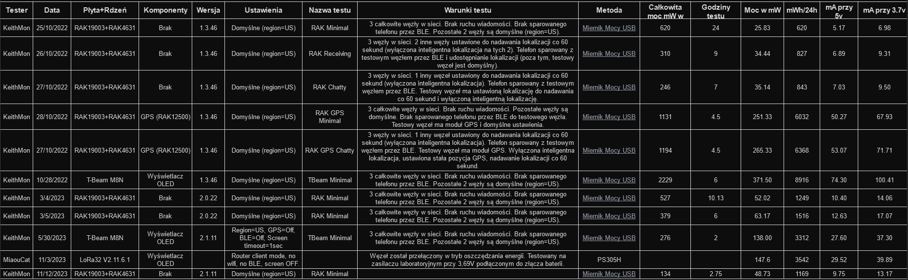

# Jak obliczyć rozmiar panelu słonecznego i akumulatora
### TL;DR
**RAK** (z GPS)
- 3 watowy panel solarny
- bateria 5000mAh

**T-Beam M8N** (z wyświetlaczem OLED)
- 5 watt solar panel
- 7300mAh battery

## Urządzenie do zasilania 
Dowiedz się, ile energii zużywa Twoje urządzenie każdego dnia.

Weźmy na przykład węzeł RAK z GPS. Zużywa on około 50mA (na godzinę, przy 5V). Mnożąc 50mA przez 24 godziny, otrzymujemy 1200mAh. Ampery i volty nie są miarą mocy, to waty. Ampery x Volty = Watty. Więc 1200mAh x 5v = 6000mWh (6 watów).

To urządzenie zużywa 6 watów mocy w ciągu dnia, co wyraża się jako 6Wh, watogodziny.

Przejrzyj poniższą tebelę, aby zapoznać się z rozkładem zużycia energii dla RAK i TBeams w różnych warunkach testowych:

[Wersja Markdown](02_obliczanie_mocy_panela_i_aku/test-poboru-mocy.md)

## Panel Słoneczny 
### Szczytowe Godziny Słoneczne (PSH) 
Dobowa moc generowana przez panel słoneczny może być obliczona poprzez pomnożenie znamionowych watów panelu ("5w", "100w", itp.) przez szczytowe godziny słoneczne (PSH) dla Twojego regionu. Szczytowe godziny słoneczne reprezentują roczną średnią "godzin słonecznych" w celu określenia generacji mocy z paneli słonecznych w danej lokalizacji. Kąt nachylenia panelu słonecznego w stosunku do słońca jest ważną częścią uzyskania pełnych PSH. Właściwy kąt zależy od Twojej lokalizacji i optymalny kąt zmienia się w ciągu roku. Znajdź najlepszy kąt dla swojej lokalizacji, [używając tego kalkulatora](https://solarsena.com/solar-panel-tilt-angle-calculator/). Znajdź swoje PSH w [USA](https://www.solarreviews.com/blog/peak-sun-hours-explained) lub w [Europie](https://www.hotspotenergy.com/DC-air-conditioner/europe-solar-hours.php). Moja okolica ma 5 PSH i zalecany kąt 44°. 
### Obudowa Słoneczna RAK ([link do sklepu RAK](https://store.rakwireless.com/products/unify-enclosure-ip65-100x75x38-solar)) 
Obudowa słoneczna RAK ma panel słoneczny o mocy 90ma przy 5v. 90ma x 5v = 450mW. 450mW x 5 szczytowych godzin słonecznych daje 2250mWh. Może ona wyprodukować 2,25 watogodziny mocy dziennie.

Możesz zobaczyć, że RAK z modułem GPS zużywa 6 watogodzin w ciągu 24 godzin, a obudowa słoneczna RAK produkuje 2,25 watogodzin w ciągu 24 godzin (w regionie z 5 PSH). Ten panel słoneczny jest znacznie za mały przy użyciu węzła RAK z GPS. 
### Panel Słoneczny 5 Watów 
Obliczmy dla panelu słonecznego o mocy 5 watów. 5w x 5 PSH = 25 watogodzin dziennie. Ten panel dostarcza więcej niż wystarczającą moc dla tego scenariusza. 
### Określ Rozmiar Panelu Słonecznego dla Twojego Urządzenia 
A co jeśli chcemy najmniejszy panel słoneczny, który zapewni niezawodne zasilanie? 
#### RAK z GPS 
Możemy wykonać to obliczenie w odwrotną stronę. Zaczynamy od zużycia energii urządzenia wynoszącego 6 watów na dzień i dzielimy to przez nasze PSH. 6w / 5h = 1,2w. Panel słoneczny o mocy 1,2 wata powinien (średnio rocznie) zapewnić odpowiednią ilość mocy dla tego urządzenia w lokalizacji z 5 PSH. Jednak PSH to średnia roczna. Ilość użytecznych godzin słonecznych w zimie będzie mniejsza (być może znacznie mniejsza). W zimie panel słoneczny o mocy 1,2 wata może nie nadążać, ponieważ jest mniej światła słonecznego (w zależności od lokalizacji). Nie mam sposobu na obliczenie tego. Jednak podwoiłbym rozmiar panelu słonecznego, aby uwzględnić mniejszą ilość światła w zimie. Panel słoneczny o mocy 2,4 wata może zapewnić wystarczającą moc do działania węzła RAK+GPS przez cały rok. Prawdopodobnie nie zdecydowałbym się na panel mniejszy niż 3 waty dla tego urządzenia. Przeskalowanie panelu jest dobrym pomysłem, ponieważ możesz nie chcieć wychodzić i zmieniać kąta panelu kilka razy w roku, aby zapewnić optymalny kąt. Ponadto, niektóre budżetowe panele słoneczne są przeszacowane (mówią, że to 5 watów, ale może to być faktycznie 3 waty). 
#### T-Beam M8N
T-Beam zużywa 371,5mW. W ciągu 24 godzin to 8916mW (lub 9 watów dla uproszczenia obliczeń). Podzielmy to przez Szczytowe Godziny Słoneczne dla mojego obszaru (mam 5 PSH). Wynosi to 9W / 5h = 1,8 watowego panelu słonecznego. Jednak musimy uwzględnić mniejszą energię w zimie (słabsze światło). Podwoimy panel słoneczny, aby być pewni. To daje 3,6W. Następnie musimy uwzględnić nieefektywność w obwodach ładowania i zasilania. Załóżmy ostrożnie, że są one 70% wydajne, co daje nam 4,68W. Więc panel słoneczny o mocy 5 watów powinien być odpowiedni. Ważne jest również, aby wziąć pod uwagę, że wiele tanich paneli słonecznych jest przeszacowanych. Ich generacja mocy jest niższa niż podane waty. 
## Rozmiar Baterii 
Nie możemy mówić o instalacji słonecznej poza siecią, nie uwzględniając także baterii. Będą dni, kiedy będzie pochmurno, deszczowo lub inaczej nie zapewniają optymalnego światła słonecznego. Aby to uwzględnić, potrzebujemy baterii, która dostarczy wystarczająco dużo energii zapasowej do pracy węzła, gdy panel słoneczny nie zapewnia energii.

Jak długo trwa typowy okres pochmurnych dni w Twoim obszarze? 2 dni? 4 dni? 1 tydzień? Każdy z tych przypadków jest możliwy. To, co planujesz, zależy całkowicie od pogody w Twojej lokalizacji i Twojej oceny ryzyka. Jak ważne jest, aby urządzenie było online 24/7/365? Mieszkam w słonecznym obszarze, więc zdecyduję, że 3 dni bez energii słonecznej jest akceptowalne dla mojego regionu i mieści się w moim poziomie ryzyka. 
#### RAK z GPS 
Teraz obliczamy pojemność baterii. Bierzemy codzienne zużycie energii 6 watów pomnożone przez 3 dni, co daje 18 watów. W tym scenariuszu nasza bateria powinna mieć pojemność 18 watogodzin (18000mWh). Dla standardowej baterii litowo-jonowej 3,7V bierzemy watogodziny podzielone przez 3,7 wolta, aby uzyskać ocenę amperogodzin. 18000mWh / 3,7V = 4864mAh. Bateria LiPo powinna mieć prawie 5000mAh. W tym scenariuszu powinniśmy mieć co najmniej baterię 5000mAh sparowaną z panelem słonecznym o mocy 3 watów. 
#### T-Beam M8N 
Zużycie energii wynosi 9W na dzień. Pomnóż to przez 3 dni (nasz margines bezpieczeństwa/ryzyka) i to daje 27Wh (27000mWh). Dla standardowej baterii litowo-jonowej 3,7V bierzemy watogodziny podzielone przez 3,7 wolta, aby uzyskać ocenę amperogodzin. 27000mWh / 3,7V = 7297mAh. Dla T-Beam M8N powinniśmy mieć co najmniej panel słoneczny o mocy 5 watów z baterią 7300mAh.

## Jak mierzyć zużycie energii przez urządzenie 
Aby zmierzyć średnie zużycie energii przez urządzenie radiowe, jak węzeł Meshtastic, potrzebne są dwie rzeczy.

Po pierwsze, potrzebujesz sposobu na pomiar mocy. Może to być zasilacz laboratoryjny z odczytami napięcia i natężenia. Może to być dedykowane urządzenie, takie jak miernik mocy USB lub coś innego. Najważniejsze jest, abyś mógł odczytać albo volty i ampery ALBO waty na przestrzeni czasu (na przestrzeni czasu oznacza, że potrzebujesz śledzić zużycie energii na przestrzeni czasu, a nie tylko natychmiastowe odczyty). Również rozważ, czy Twój miernik ma rozdzielczość, aby mierzyć tak nisko, jak potrzebujesz. Watty są miarą mocy i powinieneś używać tej jednostki, aby wyrazić, ile mocy zużywa Twoje urządzenie. Jeśli mierzysz volty i ampery, możesz uzyskać waty. To proste równanie. Po prostu pomnóż volty razy ampery, aby uzyskać waty: 5V x 50mA = 250mW (również opisane jako 5V x 0,05A = 0,25W). 250mW to miara zużytej mocy w konkretnym momencie. Nie możemy użyć tej liczby, ponieważ te urządzenia spędzają dużo czasu na odbieraniu i trochę na nadawaniu. Musimy uzyskać średnią na przestrzeni czasu.

Po drugie, czas. Radia zużywają stosunkowo mało energii podczas odbierania. W przeciwieństwie do tego, zużywają znacznie więcej energii podczas nadawania. Jest nazwa na to, ile czasu radio nadaje w porównaniu do odbierania. Nazywa się to cyklem pracy. Cykl pracy jest wyrażony w procentach. Przez jaki okres czasu ile tego czasu jest poświęcone na nadawanie? 5%? 10%? 25%? Trudno to wiedzieć. To zależy od Twojego przypadku użycia. Zamiast próbować przeprowadzać obliczenia mocy odbioru w porównaniu do mocy nadawania oparte na danych z karty katalogowej, możesz przeprowadzić symulowany test i zmierzyć zużycie energii na przestrzeni czasu. Lubię przeprowadzać testy zużycia energii przez co najmniej 1 godzinę, ale im dłużej testujesz, tym bardziej dokładne będą wyniki (jeśli warunki testu są reprezentatywne dla rzeczywistego życia). 
### Warunki Testu 
Przeprowadzenie testu w praktyce jest dość proste, ale wymaga pewnego zrozumienia, jak działa Meshtastic w tle. Węzły Meshtastic transmitują dane w regularnych odstępach czasu. Te pakiety danych to nie są wiadomości, które mogłbyś wysłać do innej osoby. Są jak boje; używane do wskazania, że węzeł jest operacyjny i w sieci, więc inne węzły wiedzą, czy są online i gdzie się znajdują (dla węzłów z GPS). Te pakiety danych są wysyłane w tle i są wymagane do funkcjonowania sieci. Inne węzły w sieci będą odpowiadać na te boje potwierdzeniem odbioru. Oznacza to, że Twoje urządzenie będzie nadawać, nawet jeśli nie wysyłasz wiadomości. Aby ustawić odpowiedni test, musisz symulować średnią częstotliwość wysyłania wiadomości na przestrzeni czasu (wiadomości, które wysyłasz ręcznie). Oznacza to również, że większa i bardziej rozmowna sieć będzie zużywać więcej energii na potwierdzenia odbioru.

W typowym przypadku użycia w Twojej sieci ile ręcznych wiadomości będzie wysyłanych w ciągu godziny (wiadomości, które wysyłasz)? 5? 10? 25? Jeśli Twoja częstotliwość wysyłania wiadomości jest niska (Twój cykl pracy), może to nie wpłynąć znacząco na zużycie energii (ponieważ węzeł i tak regularnie nadaje). To zależy całkowicie od przypadku użycia i nikt nie może powiedzieć Ci, jaki jest Twój cykl pracy. Ale możesz zgadywać i dodawać margines do swoich obliczeń, aby zapewnić czas pracy.

Jednym ze sposobów symulacji wiadomości w Meshtastic jest zwiększenie interwału nadawania lokalizacji GPS. W chwili pisania tego, domyślny interwał to 2 minuty dla normalnego węzła z GPS lub 15 minut dla węzła o stałej pozycji. Możesz zmniejszyć ten interwał, a węzeł będzie częściej nadawał wiadomość, tym samym symulując ręczną wiadomość w sieci. Możesz zmienić ten interwał w aplikacji na iPhone'a, Androida, aplikacji webowej i CLI.

Testy wymagają co najmniej 2 węzłów. Węzeł, z którego mierzysz moc i jeszcze jeden. Chociaż bardziej realistyczne może być uwzględnienie 3 lub 4 węzłów w sieciach. Celem jest być jak najbliżej rozmiaru ostatecznej sieci wdrożeniowej podczas mierzenia zużycia energii. Oto jak mierzę "rozmowną" sieć: 
- 3 węzły w sieci. 
- 1 "inny" węzeł ustawiony do nadawania lokalizacji co 60 sekund (wyłączona inteligentna lokalizacja). 
- Telefon jest sparowany z testowym węzłem przez BLE.
- Testowy węzeł ma moduł GPS (opcjonalnie, zależy to od tego, czy Twoje ostateczne wdrożenie będzie zawierało GPS). 
- Testowy węzeł ma wyłączoną inteligentną lokalizację, ustawioną stałą pozycję GPS, nadaje lokalizację co 60 sekund. 
## Rozważania Dotyczące Węzła Słonecznego 
Oto inne kwestie, które należy wspomnieć:
- Czy Twój obwód ładowania zwiększa niższe napięcie z panelu słonecznego? Zwykle ładujesz baterię LiPo na około 4,2 wolta. Jeśli napięcie Twojego panelu słonecznego spadnie poniżej tego napięcia, czy obwód ładowania nadal będzie ładował baterię (niektóre tak, inne nie)? Jeśli nie, całkowita dobową moc z Twojego panelu słonecznego może być znacząco zmniejszona (szczególnie dla małych paneli, gdzie napięcie może pozostać poniżej 4,2 przez dłuższe okresy dnia). 
- Istnieją nieefektywności przy przemieszczaniu energii (np. od słonecznego do baterii). Obwody nigdy nie są w 100% wydajne. To powinno być uwzględnione przy wymiarowaniu panelu słonecznego i baterii. Mogą być wydajne w 80% do 90%, ale to zależy od obwodu ładowania. 
- Baterie LiPo nigdy nie powinny być rozładowywane do 0%, ponieważ to zmniejszy ich żywotność. Więc planuj używać 85-90% podanej pojemności przy wymiarowaniu baterii. 
- Jak szybko Twoje urządzenie może ładować baterię? To jest prędkość ładowania. Jeśli prędkość ładowania jest zbyt niska, możesz nie wykorzystywać całej dostępnej mocy słonecznej. Na przykład, jeśli panel słoneczny ma tylko 5 godzin na naładowanie baterii 6 watami mocy (aby wytrzymać 24 godziny), musi ładować z prędkością 1,2Wh (286mA przy 4,2V). To nie jest dokładnie tak, jak to działa, ponieważ panel słoneczny będzie ładować z niższą prędkością przed i po optymalnych warunkach słonecznych. Ale to jest kwestia, którą należy wziąć pod uwagę. Dla odniesienia, płyty bazowe RAK mają maksymalny prąd ładowania baterii 350mA, więc powinny dobrze działać w tym scenariuszu.
- Baterie litowe nie lubią być ładowane, gdy temperatura otoczenia jest poniżej zera. Zaleca się znacznie wolniejszą prędkość ładowania 0,02C przy temperaturach poniżej zamarzania. Wiele (większość?) obwodów ładowania nie oferuje sposobu na zmianę prędkości ładowania w zależności od temperatury otoczenia.
- Podczas umieszczania panelu słonecznego w regionie, gdzie zimą pada śnieg, należy rozważyć, czy śnieg będzie się gromadził na panelu słonecznym. Jeśli tak, należy wziąć pod uwagę, jaką wagę panel i uchwyty są w stanie wytrzymać.

Tekst przetłumaczony na podstawie:
- https://docs.google.com/document/d/12GIY24vLKLABg2RUTPP6yMzokr44GMzJOE4p7ngaCbI/
- https://docs.google.com/document/d/16RFqDHl81j4O_MkLKLY5SYW4Bs-8IkOc2pT8pSA8Xu4/
